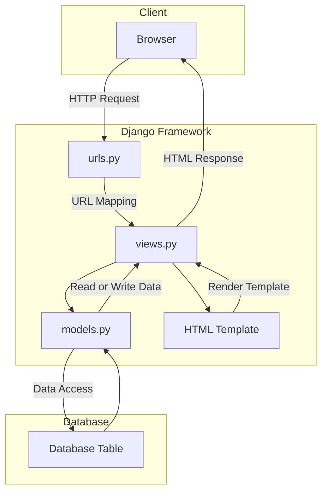

# The Hunter's Workshop

**_Assignment 2: MVT Implementation on Django_**

Website URL :

Name : Bramantyo Priyo Utomo

Class : PBP - International

## Implementation

1. The first thing I did on the project is to initialize git inside of the Project Folder Which I named `Inventory-management-app`.

2. The second step is to configure my GitHub username and email by using the `git config user.name` and `git config user.email` to the Project Folder.

3. The third step I did is create a `.gitignore` file and a placeholder `README.md` file.

4. Then finally on the fourth step, I installed the Django `main` app in the project folder using a Python virtual environment, because I am using a mac, the way I activated the Python virtual environment is by using the `python -m venv env` command and activate it using `source env/bin/activate` in the terminal.

5. On the fifth step, I implemented and integrated the basic model view template for the website, where I filled the `models.py`, `views.py`, and also the template `html` file.

6. The sixth step is configuring the URL routing for main, where I filled in the `urls.py` file inside the main and in the project folder.

7. The seventh step is filling in the file to create a placeholder test file.

8. The eighth step is adding, committing, and pushing all the files from my local project folder into my GitHub repository. This was where I made the mistake of pushing the wrong directory into my repo, I mistakenly navigated into the `Django project folder` instead of the `outside project` folder which I then quickly discovered that I can just move the files of the into the outside `project folder` which reverted my mistake.

9. After realizing that I have `git push`-ed the placeholder project, I quickly filled in the correct model in the `models.py` files where I put all of the attributes for the `weapons` class for The Hunter's Workshop.

10. And that concludes the Implementations. The app should be deployed shortly after I have finished typing this `README.md`, which I have linked the url at the top of this file.

11. A little update, there have been some drama surrounding the `Adaptable.io` site for deployment, which I have been banned from using. Thus the deployment of this repo has been postponed.

## Django MVT Diagram

## Virtual Environment

Virtual Environment is a tool that helps to keep dependencies required by different projects separate by creating isolated python virtual environments for them. This is one of the most important tools that most of the Python developers use.

The way I used Virtual Enviroment in this project is by creating a virtual environment inside of the project folder, which I named `env`. I then activated the virtual environment by `python -m venv env` and activate it using `source env/bin/activate` inside the terminal and installed the Django app inside of it. This way, the Django app is only installed inside of the virtual environment and not on my local machine.

Virtual Environments also make it easier to collaborate with other developers. Other developers can easily install the dependencies used by the project without interfering with other projects or their dependencies.

## MVC, MVT, and MVVM

`MVC` or Model View Controller is a software design pattern that is used to develop web applications. The `MVC` pattern separates an application into three main components: the Model, the View, and the Controller.

`MVT` on the other hand is a software design pattern that is a variation of the `MVC` pattern used for developing web applications. The `MVT` pattern separates an application into three main components: the Model, the View, and the Template.

And finally, `MVVM` is a software design pattern that is a variation of the `MVC` pattern used for developing web applications. The `MVVM` pattern separates an application into three main components: the Model, the View, and the View Model.
