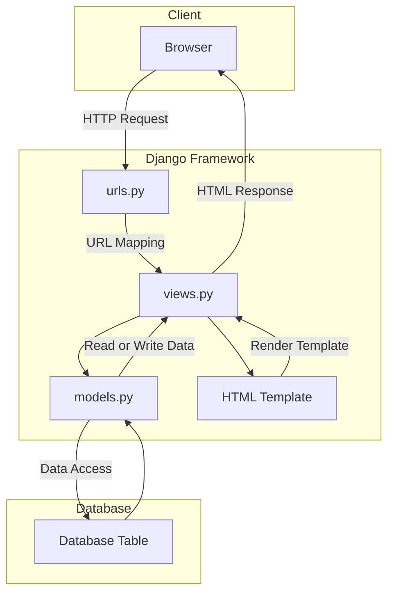

# <a href="bramantyo-priyo-tugas.pbp.cs.ui.ac.id">The Hunter's Workshop</a>

Name : Bramantyo Priyo Utomo

Class : PBP - International

<details>
<summary><Strong>Assignment 2: Implementating Introduction to Django and Model-View-Template</strong></summary>

1. The first thing I did on the project is to initialize git inside of the Project Folder Which I named `Inventory-management-app`.

2. The second step is to configure my GitHub username and email by using the `git config user.name` and `git config user.email` to the Project Folder.

3. The third step I did is create a `.gitignore` file and a placeholder `README.md` file.

4. Then finally on the fourth step, I installed the Django `main` app in the project folder using a Python virtual environment, because I am using a mac, the way I activated the Python virtual environment is by using the `python -m venv env` command and activate it using `source env/bin/activate` in the terminal.

5. On the fifth step, I implemented and integrated the basic model view template for the website, where I filled the `models.py`, `views.py`, and also the template `html` file.

6. The sixth step is configuring the URL routing for main, where I filled in the `urls.py` file inside the main and in the project folder.

7. The seventh step is filling in the file to create a placeholder test file.

8. The eighth step is adding, committing, and pushing all the files from my local project folder into my GitHub repository. This was where I made the mistake of pushing the wrong directory into my repo, I mistakenly navigated into the `Django project folder` instead of the `outside project` folder which I then quickly discovered that I can just move the files of the into the outside `project folder` which reverted my mistake.

9. After realizing that I have `git push`-ed the placeholder project, I quickly filled in the correct model in the `models.py` files where I put all of the attributes for the `weapons` class for The Hunter's Workshop.

10. And that concludes the Implementations. The app should be deployed shortly after I have finished typing this `README.md`, which I have linked the url at the top of this file.

11. A little update, there have been some drama surrounding the `Adaptable.io` site for deployment, which I have been banned from using. Thus the deployment of this repo has been postponed.

## Django MVT Diagram



## Virtual Environment

Virtual Environment is a tool that helps to keep dependencies required by different projects separate by creating isolated python virtual environments for them. This is one of the most important tools that most of the Python developers use.

The way I used Virtual Enviroment in this project is by creating a virtual environment inside of the project folder, which I named `env`. I then activated the virtual environment by `python -m venv env` and activate it using `source env/bin/activate` inside the terminal and installed the Django app inside of it. This way, the Django app is only installed inside of the virtual environment and not on my local machine.

Virtual Environments also make it easier to collaborate with other developers. Other developers can easily install the dependencies used by the project without interfering with other projects or their dependencies.

## MVC, MVT, and MVVM

`MVC` or Model View Controller is a software design pattern that is used to develop web applications. The `MVC` pattern separates an application into three main components: the Model, the View, and the Controller.

`MVT` on the other hand is a software design pattern that is a variation of the `MVC` pattern used for developing web applications. The `MVT` pattern separates an application into three main components: the Model, the View, and the Template.

And finally, `MVVM` is a software design pattern that is a variation of the `MVC` pattern used for developing web applications. The `MVVM` pattern separates an application into three main components: the Model, the View, and the View Model.

</details>
<details>

<summary><Strong>Assignment 3: Implementing forms into `views.py` and `urls.py`</strong></summary>

12. To implement a form input to add a model object, I created a new file inside the `main` folder named `forms.py` as such:

```python
from django.forms import ModelForm
from main.models import Weapons


class WeaponForm(ModelForm):
    class Meta:
        model = Weapons
        fields = [
            "name",
            "type",
            "attack_rating",
            "amount",
            "description",
        ]
```

13. And in the `views.py` file inside the `main` folder, I imported the `WeaponForm` class from the `forms.py`.

14. Then I added the `weapons: weapon` to the show_main function so that the form could be displayed inside the main.

15. In the `urls.py` file, I also imported the `create_weapon.html` so that the form is shown properly.

16. I also added the following block of code to `urlpatterns`.

```python
path('create-weapon', create_weapon, name='create_weapon'),
```

17. Remember the `create_weapon.html` file, it looks something like this:

```html
 
<h1>Add New Weapon</h1>

<form method="POST">
  
  <table>
    {{ form.as_table }}
    <tr>
      <td></td>
      <td>
        <input type="submit" value="Add Product" />
      </td>
    </tr>
  </table>
</form>


```

18. I also updated the `main.html` file so that the form and the table is displayed in main.

```html
<table>
  <tr>
    <th>Name</th>
    <th>Type</th>
    <th>Attack Rating</th>
    <th>Amount</th>
    <th>Description</th>
    <th>Date Added</th>
  </tr>

  
  <tr>
    <td>{{weapon.name}}</td>
    <td>{{weapon.type}}</td>
    <td>{{weapon.attack_rating}}</td>
    <td>{{weapon.amount}}</td>
    <td>{{weapon.description}}</td>
    <td>{{weapon.date_added}}</td>
  </tr>
  
</table>

<br />

<a href="">
  <button>Add New Weapon</button>
</a>

```

19. I also added a counter to `main` by updating the `show_main` function as such:

```python
def show_main(request):
    weapons = Weapons.objects.all()
    counter = Weapons.objects.count()
    context = {
        "name": "Bramantyo",
        "class": "PBP International",
        "weapons": weapons,
        "counter": counter,
    }

    return render(request, "main.html", context)
```

20. I also added 5 new views in `views.py` file so that the objects could be viewed in `HTML`, `XML`, `JSON`, `XML by ID`, and `JSON by ID` formats. as such:

```python
def show_xml(request):
    data = Weapons.objects.all()
    return HttpResponse(
        serializers.serialize("xml", data), content_type="application/xml"
    )


def show_json(request):
    data = Weapons.objects.all()
    return HttpResponse(
        serializers.serialize("json", data), content_type="application/json"
    )


def show_xml_by_id(request, id):
    data = Weapons.objects.filter(pk=id)
    return HttpResponse(
        serializers.serialize("xml", data), content_type="application/xml"
    )


def show_json_by_id(request, id):
    data = Weapons.objects.filter(pk=id)
    return HttpResponse(
        serializers.serialize("json", data), content_type="application/json"
    )
```

21. In order for the functions to be able to run properly, I added the following to the `urls.py` `urlspattern` as such:

```python
    path("xml/", show_xml, name="show_xml"),
    path("json/", show_json, name="show_json"),
    path("xml/<int:id>/", show_xml_by_id, name="show_xml_by_id"),
    path("json/<int:id>/", show_json_by_id, name="show_json_by_id"),
```

## Difference between POST form and GET form in Django

In Django, both `POST` and `GET` are `HTTP` methods used to request and send data to a web server. When working with forms in Django, the choice between using `POST` and `GET` has significant implications for how the data is transmitted and processed.

1. `GET`:
   Data is appended to the URL as query parameters.
   Visible in the URL.
   Less secure for sensitive information.
   Suitable for read-only operations and bookmarkable URLs.
   May be cached by browsers.
   Idempotent (should not change server state).
2. `POST`:
   Data is sent in the request body.
   Not visible in the URL.
   More secure for sensitive information.
   Suitable for actions that modify server data.
   Not typically cached by browsers.
   Not idempotent (can change server state).

## Main differences between XML, JSON, and HTML in data delivery

`XML`, `JSON`, and `HTML` are three different data formats used for various purposes, including data delivery.

1. **`XML` (Extensible Markup Language):**

Purpose: Versatile markup language for structuring and describing data.
Syntax: Uses tags enclosed in angle brackets, requiring opening and closing tags.
Human-Readability: Human-readable but can be verbose.
Data Types: No native data types; must be defined within the document structure.
Usage: Commonly used for data interchange, configuration files, and document storage.
Extensibility: Highly extensible, allowing custom tags and
structures.

2. **`JSON` (JavaScript Object Notation):**

Purpose: Lightweight data interchange format for easy data exchange.
Syntax: Simple and concise, using key-value pairs with support for nested structures.
Human-Readability: Highly human-readable and preferred for configuration files and APIs.
Data Types: Supports strings, numbers, booleans, arrays, and objects.
Usage: Widely used in web development, APIs, and web services.
Extensibility: Less extensible, follows a predefined key-value pair structure.

3. **`HTML` (Hypertext Markup Language):**

Purpose: Primarily used for structuring and rendering web content.
Syntax: Defines content structure with predefined tags for headings, paragraphs, lists, etc.
Human-Readability: Designed for human consumption, focused on content presentation.
Data Types: Primarily deals with text and multimedia content.
Usage: Exclusively for web content presentation and rendering in web browsers.
Extensibility: Not designed for extensibility, has a fixed set of tags and elements.

## Why is JSON often used in data exchange between modern web apps?

`JSON`'s simplicity, efficiency, compatibility, and versatility make it a go-to choice for data exchange in modern web applications. Its ease of use and broad support across different technologies have contributed to its widespread adoption in the web development ecosystem.

## This is what happens when we access the URLs using Postman


</details>
<details>
<summary><Strong>Assignment 4: Implementing Authentication, Sessions, and `cookies` in Django</strong></summary>

22. The first thing I did was to implement the registration form and functionality in the `views.py` file as such:

```python
from django.shortcuts import redirect
from django.contrib.auth.forms import UserCreationForm
from django.contrib import messages

def register(request):
    form = UserCreationForm()

    if request.method == "POST":
        form = UserCreationForm(request.POST)
        if form.is_valid():
            form.save()
            messages.success(request, "Your account has been successfully created!")
            return redirect("main:login")
    context = {"form": form}
    return render(request, "register.html", context)
```

23. Then I created a new HTML file named `register.html` inside the `templates` folder as such:

```html
 
<title>Register</title>
 

<div class="login">
  <h1>Register</h1>

  <form method="POST">
    
    <table>
      {{ form.as_table }}
      <tr>
        <td></td>
        <td><input type="submit" name="submit" value="Daftar" /></td>
      </tr>
    </table>
  </form>

  
  <ul>
    
    <li>{{ message }}</li>
    
  </ul>
  
</div>


```

24. I also added the following to the `urls.py` file so that the `register` function could be accessed properly:

```python
    path("register/", register, name="register"),
```

25. Then I added the login function inside `views.py` as such:

```python
from django.contrib.auth import authenticate, login

def login_user(request):
    if request.method == "POST":
        username = request.POST.get("username")
        password = request.POST.get("password")
        user = authenticate(request, username=username, password=password)
        if user is not None:
            login(request, user)
            response = HttpResponseRedirect(reverse("main:show_main"))
            response.set_cookie("last_login", str(datetime.datetime.now()))
            return response
        else:
            messages.info(
                request, "Sorry, incorrect username or password. Please try again."
            )
    context = {}
    return render(request, "login.html", context)
```

26. I also created a new HTML file called `login.html` inside the main app as such:

```html
 
<title>Login</title>
 

<div class="login">
  <h1>Login</h1>

  <form method="POST" action="">
    
    <table>
      <tr>
        <td>Username:</td>
        <td>
          <input
            type="text"
            name="username"
            placeholder="Username"
            class="form-control"
          />
        </td>
      </tr>

      <tr>
        <td>Password:</td>
        <td>
          <input
            type="password"
            name="password"
            placeholder="Password"
            class="form-control"
          />
        </td>
      </tr>

      <tr>
        <td></td>
        <td><input class="btn login_btn" type="submit" value="Login" /></td>
      </tr>
    </table>
  </form>

  
  <ul>
    
    <li>{{ message }}</li>
    
  </ul>
   Don't have an account yet?
  <a href="">Register Now</a>
</div>


```

27. Inside the `urls.py` I added a new path to `urlpatterns` as such:

```python
    path("login/", login_user, name="login"),
```

28. Then I added a logout function to `views.py` as such:

```python
from django.contrib.auth import logout

def logout_user(request):
    logout(request)
    return redirect('main:login')
```

29. Inside the `main.html`, I added a new button to the page as such:

```html
<a href="">
  <button>Logout</button>
</a>
```

30. I also added a new url to `urls.py` as such:

```python
from main.views import logout_user

path('logout/', logout_user, name='logout'),
```

31. I also restricted the access to the `main` page by adding the `@login_required` decorator to the `show_main` function as such:

```python
from django.contrib.auth.decorators import login_required

@login_required(login_url='/login')
def show_main(request):
```

32. I will also explore the use of `cookies` by adding a "last login" feature to the `login` function inside `views.py` as such:

```python
import datetime
from django.http import HttpResponseRedirect
from django.urls import reverse

if user is not None:
    login(request, user)
    response = HttpResponseRedirect(reverse("main:show_main"))
    response.set_cookie('last_login', str(datetime.datetime.now()))
    return response
```

33. Inside the `show_main` function in `views.py` I also added a last login as such:

```python
@login_required(login_url="/login")
def show_main(request):
    weapons = Weapons.objects.filter(user=request.user)
    counter = weapons.count()
    context = {
        "name": request.user.username,
        "class": "PBP International",
        "weapons": weapons,
        "counter": counter,
        "last_login": request.COOKIES["last_login"]
        if "last_login" in request.COOKIES.keys()
        else "",
    }

    return render(request, "main.html", context)
```

34. I also modified the `logout_user` function as such:

```python
def logout_user(request):
    logout(request)
    response = HttpResponseRedirect(reverse('main:login'))
    response.delete_cookie('last_login')
    return response
```

35. Inside the `main.html` file, I addded the last login session which displays the last login time as such:

```html
<h5>Last login session: {{ last_login }}</h5>
```

36. To connect the `Weapons` model to `user` model, I need to link the object to the `user` who created it, I implemented it as such:

```python
from django.contrib.auth.models import User

class Weapons(models.Model):
    user = models.ForeignKey(User, on_delete=models.CASCADE)
```

37. Inside the `create_weapon` function in `views.py`, I also modified the code as follows:

```python
def create_weapon(request):
    form = WeaponForm(request.POST or None)

    if form.is_valid() and request.method == "POST":
        weapon = form.save(commit=False)
        weapon.user = request.user
        weapon.save()
        return HttpResponseRedirect(reverse("main:show_main"))

    context = {"form": form}
    return render(request, "create_weapon.html", context)
```

38. I also modified the `show_main` function as such, this makes sure that the objects that users created are shown in the main page and counts the correct number of weapons that the user has created:

```python
@login_required(login_url="/login")
def show_main(request):
    weapons = Weapons.objects.filter(user=request.user)
    counter = weapons.count()
```

## `UserCreationForm` in Django

`UserCreationForm` is a built-in Django form that provides a simple way to create a new user account. It is a subclass of `django.contrib.auth.forms.UserCreationForm` and provides a set of fields for the user to enter their username, email, and password.

Advantages:

1. `UserCreationForm` is easy to use and requires minimal setup.
2. It provides built-in validation for the username, email, and password fields.
3. It automatically hashes the password before storing it in the database.
4. It can be customized to include additional fields or validation.

Disadvantages:

1. `UserCreationForm` provides a limited set of fields and may not be suitable for all use cases.
2. It does not provide any additional features such as email verification or two-factor authentication.
3. It may not be suitable for applications that require more complex user registration workflows.

Overall, `UserCreationForm` is a useful tool for quickly creating a simple user registration form in Django. However, for more complex applications, it may be necessary to create a custom registration form that includes additional fields and features.

## Differences Betweeen Authentication and Authorization

Authentication is the process of verifying the identity of a user. In Django, authentication is the process of verifying that a user is who they claim to be. This is typically done by asking the user to provide a username and password, and then checking those credentials against a database of users. Django provides built-in authentication views and forms that make it easy to add authentication to your application.

Authorization, on the other hand, is the process of determining what a user is allowed to do. In Django, authorization is the process of determining whether a user has permission to perform a specific action, such as accessing a particular page or editing a particular object. Django provides a built-in permission system that allows you to define permissions for your models and views.

Authentication and authorization are both important for web application security. Authentication verifies the identity of a user, while authorization determines what a user is allowed to do. Django provides built-in tools for both authentication and authorization, making it easy to add these features to your application.

## `cookies` in Websites

`Cookies` are small text files that are stored on a user's computer by a website. They are used to store information about the user's preferences, login status, and other data that can be used to personalize the user's experience on the website.

In Django, cookies are used to manage user session data. When a user logs in to a Django application, a session is created for that user. The session data is stored on the server, but a unique session ID is also stored in a cookie on the user's computer. This allows the server to identify the user and retrieve their session data when they make subsequent requests to the application.

By default, Django uses a secure, cryptographically signed cookie to store the session ID. This helps to prevent tampering and ensures that the session data is only accessible to the server.

## Security of `Cookies`

`cookies` can be secure to use if they are implemented correctly. However, there are potential risks that you should be aware of when using `cookies` in your web application.

One potential risk is that `cookies` can be intercepted or tampered with by attackers. If a cookie is intercepted, an attacker could use it to impersonate the user and gain access to their account. To mitigate this risk, it is important to use secure, encrypted `cookies` that cannot be easily tampered with.

`cookies` can also be vulnerable to cross-site scripting (XSS) attacks. If an attacker is able to inject malicious code into a website, they could use it to steal `cookies` or other sensitive information from users. To mitigate this risk, it is important to use secure coding practices and to sanitize all user input to prevent XSS attacks.

</details>

<details>
<summary><strong>Assignment 5: CSS Styling Implementation using Tailwindcss</strong></summary>

39. The first thing I did was to install `tailwindcss` using CDN installation method. I added the following to the `base.html` file:

```html
<script src="https://cdn.tailwindcss.com"></script>
```

40. Main HTML Page Summary

This code defines the structure of the main page for "The Hunter's Workshop" web application. It extends a base.html template and customizes the content for the main page.

**Navigation Bar**

The navigation bar includes the website's logo and a "Logout" button.

```html
<nav
  class="bg-white dark:bg-gray-900 fixed w-full z-20 top-0 left-0 border-b border-gray-200 dark:border-gray-600"
>
  <!-- Logo and navigation links -->
</nav>
```

41. User Information

Displays a greeting message for the user, showing their name and class

```html
<p class="text-gray-500 whitespace-nowrap dark:text-gray-400">
  Welcome, {{ name }}! from {{ class }}
</p>
```

42. Weapons Table

A table displaying the user's weapons with options to interact with each weapon (add, drop, purge, edit). The table is generated dynamically based on the user's weapons.

```html
<table
  class="w-full text-sm text-center text-gray-500 dark:text-gray-400 border-separate border border-gray-900 mx-auto"
>
  <!-- Table headers and weapon data -->
</table>
```

43. Action Buttons

Buttons for adding, dropping, purging, and editing weapons are provided within the table.

```html
<button type="button" class="focus:outline-none ...">Add</button>
<button type="button" class="focus:outline-none ...">Drop</button>
<button type="button" class="focus:outline-none ...">Purge</button>
<button type="button" class="focus:outline-none ...">Edit</button>
```

44. Informational Messages

Messages at the bottom of the page provide additional information:

1. A disclaimer about the website's affiliation.
2. The last login session timestamp.

```html
<h5 class="text-gray-500 whitespace-nowrap dark:text-gray-400">
  This website is not affiliated with Bloodborne or FromSoftware.
</h5>
<h5 class="text-gray-500 whitespace-nowrap dark:text-gray-400">
  Last login session: {{ last_login }}
</h5>
```

45. Add New Weapon Button

A button to add a new weapon to the user's collection is displayed at the top of the table.

```html
<a href="">
  <button type="button" class="focus:outline-none ...">Add New Weapon</button>
</a>
```

46. Login Page Summary

This code defines the structure of the login page for the "The Hunter's Workshop" web application. It extends a base.html template and customizes the content for the login page.

**Page Title**

Sets the page title to "Login" in the meta block.

```html

<title>Login</title>

```

47. Form Section

Displays a login form with input fields for username and password.

```html
<form class="space-y-6" method="POST" action="">
  
  <div>
    <h5 class="text-xl pb-2 font-medium text-gray-900 dark:text-white">
      Username:
    </h5>
    <input
      type="text"
      name="username"
      placeholder="Username"
      class="form-control ..."
    />
  </div>
  <div>
    <h5 class="text-xl pb-2 font-medium text-gray-900 dark:text-white">
      Password:
    </h5>
    <input
      type="password"
      name="password"
      placeholder="Password"
      class="form-control ..."
    />
  </div>
  <div class="text-center">
    <button type="button" class="focus:outline-none ...">
      <input class="btn login_btn" type="submit" value="Login" />
    </button>
  </div>
</form>
```

48. Error Messages

Displays error messages if there are any. Error messages are represented as list items and include an exclamation icon.

```html
<div class="flex flex-col text-base pt-4 font-medium text-gray-500">
  <div class="text-center">
    
    <ul>
      
      <li class="inline-flex items-center">
        <svg
          xmlns="http://www.w3.org/2000/svg"
          width="16"
          height="16"
          fill="currentColor"
          class="bi bi-exclamation-triangle-fill mr-2"
          viewBox="0 0 16 16"
        >
          <path ... /></svg
        ><span>{{ message }}</span>
      </li>
      
    </ul>
    
  </div>
</div>
```

49. Registration Link

Provides a link to the registration page for users who do not have an account.

```html
Don't have an account yet?
<a
  href=""
  class="text-blue-700 hover:underline dark:text-blue-500"
>
  Register now!
</a>
```

50. Registration Form

Displays a registration form with input fields for username, password, and password confirmation.

```html
<form class="space-y-6" method="POST" action="">
  
  <div class="text-xl pb-2 font-medium text-gray-900 dark:text-white">
    <div class="mb-4">
      <label for="{{ form.username.id_for_label }}" class="block mb-2"
        >Username:</label
      >
      <input
        type="text"
        name="{{ form.username.name }}"
        placeholder="Username"
        class="form-control ..."
        value="{{ form.username.value|default:'' }}"
        required
      />
    </div>
    <div class="mb-4">
      <label for="{{ form.password1.id_for_label }}" class="block mb-2"
        >Password:</label
      >
      <input
        type="password"
        name="{{ form.password1.name }}"
        placeholder="Password"
        class="form-control ..."
        required
      />
    </div>
    <div class="mb-4">
      <label for="{{ form.password2.id_for_label }}" class="block mb-2"
        >Confirm Password:</label
      >
      <input
        type="password"
        name="{{ form.password2.name }}"
        placeholder="Confirm Password"
        class="form-control ..."
        required
      />
    </div>
  </div>
  <div class="text-center">
    <button type="button" class="focus:outline-none ...">
      <input type="submit" name="submit" value="Register" />
    </button>
  </div>
</form>
```

51. Error Messages

Displays error messages if there are any. Error messages are represented as list items.

```html

<ul>
  
  <li>{{ message }}</li>
  
</ul>

```

52. Login Link

Provides a link to the login page for users who already have an account.

```html
Already Have an Account?
<a
  href=""
  class="text-blue-700 hover:underline dark:text-blue-500"
>
  Login Now!
</a>
```

53. Add New Weapon Page and Edit Page

This code defines the structure of the "Add New Weapon" page for the "The Hunter's Workshop" web application. It extends a base.html template and customizes the content for adding a new weapon.

**Page Content**

Displays a form for adding a new weapon with input fields for name, type, attack rating, amount, and description.

```html
<div class="w-screen flex flex-col items-center justify-center">
  <div
    class="bg-white border border-gray-200 rounded-lg shadow sm:p-6 md:p-8 dark:bg-gray-800 dark:border-gray-700"
    style="width: 50%;"
  >
    <h1 class="text-xl text-center font-medium text-gray-900 dark:text-white">
      Add New Weapon!
    </h1>
    <form class="space-y-6" method="POST" action="">
      
      <div class="text-xl pb-2 font-medium text-gray-900 dark:text-white">
        <div class="mb-4">
          <!-- Name input -->
        </div>
        <div class="mb-4">
          <!-- Type input -->
        </div>
        <div class="mb-4">
          <!-- Attack Rating input -->
        </div>
        <div class="mb-4">
          <!-- Amount input -->
        </div>
        <div class="mb-4">
          <!-- Description input (textarea) -->
        </div>
        <div class="text-center">
          <button type="button" class="focus:outline-none ...">
            <input type="submit" value="Add" />
          </button>
        </div>
      </div>
    </form>
  </div>
</div>
```

## CSS Selectors

CSS element selectors are used to target HTML elements based on their tag name. They are the simplest and most common type of selector in CSS. Here are some examples of CSS element selectors:

```css
/* Select all <p> elements */
p {
  color: red;
}

/* Select all <a> elements */
a {
  text-decoration: none;
}

/* Select all <h1> elements */
h1 {
  font-size: 2em;
}
```

Element selectors are useful when you want to apply a style to all instances of a particular HTML element. For example, if you want to change the font color of all paragraphs on your website, you can use the p selector to target all `<p>` elements and apply the desired style.

However, element selectors can also be too broad and apply styles to unintended elements. For example, if you use the a selector to remove the underline from all links on your website, it will also remove the underline from any other elements that use the `<a>` tag, such as navigation menus.

In general, it's best to use element selectors sparingly and to combine them with other types of selectors, such as class or ID selectors, to target specific elements more precisely. This can help you avoid unintended styling and make your CSS more maintainable over time.

## HTML5 Tags

HTML5 introduced several new tags that are designed to make it easier to structure web pages and provide more semantic meaning to the content. Here are some of the HTML5 tags that I know:

1. `<header>`: Defines a header section for a document or a section of a document.
2. `<nav>`: Defines a set of navigation links.
3. `<section>`: Defines a section of a document, such as a chapter, a header, a footer, or any other distinct grouping of content.
4. `<article>`: Defines an independent, self-contained piece of content, such as a blog post or a news article.
5. `<aside>`: Defines content that is tangentially related to the main content of the page, such as a sidebar or a callout box.
6. `<footer>`: Defines a footer section for a document or a section of a document.
7. `<main>`: Defines the main content of a document.
8. `<figure>`: Defines a self-contained piece of content, such as an image, a video, or a diagram, that is referenced in the main content of the page.
9. `<figcaption>`: Defines a caption or description for a `<figure>` element.
10. `<time>`: Defines a date or time value.
    These tags can help make your HTML code more semantic and easier to understand, both for humans and for search engines. By using these tags appropriately, you can create more accessible and well-structured web pages.

## Margins and Padding

Margin and padding are both CSS properties that affect the spacing and layout of elements on a web page, but they work in different ways.

Margin is the space between an element and its neighboring elements. It creates space outside of an element's border. Margin can be set to a specific value, such as `margin: 10px;`, or it can be set to different values for each side of an element, such as `margin-top: 10px;` `margin-right: 20px;` `margin-bottom: 10px;` `margin-left: 20px;.`

Padding, on the other hand, is the space between an element's content and its border. It creates space inside of an element's border. Padding can also be set to a specific value, such as padding: 10px;, or it can be set to different values for each side of an element, such as `padding-top: 10px; padding-right: 20px; padding-bottom: 10px; padding-left: 20px;`.

In summary, margin creates space outside of an element's border, while padding creates space inside of an element's border. Understanding the differences between margin and padding is important for creating well-designed and visually appealing web pages.

## Differences between Tailwindcss and Bootstrap

One of the main differences between Tailwind and Bootstrap is their approach to styling. Tailwind provides a set of utility classes that can be used to apply specific styles to elements, while Bootstrap provides pre-designed components that can be customized using CSS classes and styles. This means that Tailwind gives developers more control over the styling of their elements, while Bootstrap provides a more opinionated and consistent design system.

Another difference between the two frameworks is their file size. Tailwind is designed to be lightweight and modular, with a smaller file size than Bootstrap. This can make it a good choice for projects where performance is a priority.

When deciding whether to use Bootstrap or Tailwind, it's important to consider the specific needs of your project. If you need a consistent and opinionated design system with pre-designed components, Bootstrap may be a good choice. If you need more control over the styling of your elements and want a lightweight framework, Tailwind may be a better fit.

</details>
<details>
<summary><strong>Assignment 6: JavaScript and Asynchronous JavaScript</strong></summary>

54. The first thing I did was to create a new function inside `views.py` called `get_products_json` as such:

```python
def get_product_json(request):
    weapons = Weapons.objects.filter(user=request.user)
    return HttpResponse(serializers.serialize("json", weapons))

```

It uses the filter to get all the weapons that the user has created and then returns the data in JSON format.

55. Then I added another function inside `views.py` called `add_product_ajax` which is used to add a new weapon to the database as such with ajax:

```python
@csrf_exempt
def add_product_ajax(request):
    if request.method == "POST":
        name = request.POST.get("name")
        type = request.POST.get("type")
        attack_rating = request.POST.get("attack_rating")
        amount = request.POST.get("amount")
        description = request.POST.get("description")
        user = request.user

        new_product = Weapons(
            name=name,
            type=type,
            attack_rating=attack_rating,
            amount=amount,
            description=description,
            user=user,
        )
        new_product.save()
        return HttpResponse(b"CREATED", status=201)
```

56. I also added the function for the bonus points which is to delete a weapon from the database as such:

```python
@csrf_exempt
def delete_product_ajax(request, id):
    product = Weapons.objects.get(pk=id)
    product.delete()
    return HttpResponse(b"DELETED", status=201)
```

The CSRF exempt is used to exempt the CSRF token from the request. This is because the request is sent from JavaScript and not from a form.

57. Then I routed the `add_product_ajax` and `get_product_json` function to the `urls.py` file as such:

```python
path('get-product/', get_product_json, name='get_product_json'),
path('create-product-ajax/', add_product_ajax, name='add_product_ajax')
path(
        "delete-product-ajax/<int:id>", delete_product_ajax, name="delete_product_ajax"
    ),
```

58. I am also using `fetch()` API to show the table for my products

```javascript
<script>
    async function getProducts() {
      return fetch("").then((res) => res.json())
    }
    async function refreshProducts() {
      const items = await getProducts();
      let htmlString = `
      <div class="relative shadow-md sm:rounded-lg" style="max-width: 82%; margin: 0 auto;">
        <table class="w-full text-sm text-center dark:text-gray-400 border-separate border border-gray-900 mx-auto">
          <thead class="text-xs uppercase dark:bg-gray-700 dark:text-gray-400">
            <tr>
              <th scope="col" class="px-2 py-2">Name</th>
              <th scope="col" class="px-2 py-2">Type</th>
              <th scope="col" class="px-2 py-2">Attack Rating</th>
              <th scope="col" class="px-2 py-2">Amount</th>
              <th scope="col" class="px-2 py-2">Description</th>
              <th scope="col" class="px-2 py-2">Date Added</th>
              <th scope="col" class="px-2 py-2">Delete</th>
            </tr>
          </thead>
      `;
      items.forEach((item, index) => {
        const isLastItem = index === items.length - 1;
        const rowClass = isLastItem
          ? 'bg-gray-700 dark:bg-gray-00 transition-colors duration-200 hover:bg-green-900 dark:hover:bg-green-900'
          : 'bg-white border-b dark:bg-gray-900 dark:border-gray-700 transition-colors duration-200 hover:bg-gray-100 dark:hover:bg-gray-700';
        htmlString += `
        <tr class="${rowClass}">
          <td class="px-6 py-4 font-medium text-gray-900 whitespace-nowrap dark:text-white">${item.fields.name}</td>
          <td class="px-6 py-4">${item.fields.type}</td>
          <td class="px-6 py-4">${item.fields.attack_rating}</td>
          <td class="px-6 py-4">${item.fields.amount}</td>
          <td class="px-6 py-4">${item.fields.description}</td>
          <td class="px-6 py-4">${item.fields.date_added}</td>
          <td class="px-6 py-4">
              <button class="focus:outline-none text-white bg-red-700 hover:bg-red-800 focus:ring-4 focus:ring-red-300 font-medium rounded-lg text-sm px-5 py-2.5 dark:bg-red-600 dark:hover:bg-red-700 dark:focus:ring-red-900" onclick="deleteProduct(${item.pk})">
                  Delete
              </button>
          </td>
        </tr>
      `;
      });
      htmlString += `
          </tbody>
        </table>
      </div>
    `;
      document.getElementById("product_table").innerHTML = htmlString;
    }
```

What this block of code does is that it fetches the data from the database and then displays it in the table. It also has a delete button which calls the `deleteProduct` function.

59. I also added the script to add products using the modal which I called `addProducts()` as such:

```javascript
function addProduct() {
  console.log("click");
  const modal = document.getElementById("tw-modal");
  fetch("", {
    method: "POST",
    body: new FormData(document.querySelector("#form")),
  }).then(refreshProducts);

  document.getElementById("form").reset();
  modal.close();
  return false;
}
```

60. I added the script to delete products called `deleteProduct()` as such:

```javascript
function deleteProduct(id) {
  fetch("delete-product-ajax/" + id, {
    method: "POST",
  }).then(refreshProducts);

  document.getElementById("form").reset();
  return false;
}
document.getElementById("button_add").onclick = addProduct;
```

61. This is the modal that I am using to add products:

```html
<div class="pt-5 relative">
  <h5 class="text-center text-gray-600">
    This website is not affiliated with Bloodborne or FromSoftware in any way.
  </h5>
  <h5 class="text-center text-gray-600">
    Last login session: {{ last_login }}
  </h5>
</div>

<input
  type="checkbox"
  id="tw-modal"
  class="peer fixed appearance-none opacity-0"
/>

<label
  for="tw-modal"
  class="fixed top-0 left-0 right-0 bottom-0 z-50 flex items-center justify-center pt-10 bg-gray-900 bg-opacity-50 transition-all duration-200 ease-in-out cursor-pointer invisible peer-checked:pointer-events-auto peer-checked:visible peer-checked:opacity-100"
>
  <label
    class="flex flex-col items-center justify-center bg-white border border-gray-200 rounded-lg shadow p-6 sm:p-8 md:w-96 dark:bg-gray-800 dark:border-gray-700"
  >
    <h1
      class="text-2xl font-bold leading-tight tracking-tight text-gray-900 md:text-3xl dark:text-white pb-4 pt-4 pl-4 pr-4"
    >
      Add New Product
    </h1>
    <form id="form" onsubmit="return false" class="px-4">
      
      <div class="mb-3">
        <label
          for="name"
          class="block mb-2 text-lg font-medium text-gray-900 dark:text-white"
          >Name:</label
        >
        <input
          type="text"
          placeholder="Name"
          class="form-control bg-gray-50 border border-gray-300 text-gray-900 text-sm rounded-lg focus:ring-blue-500 focus:border-blue-500 block w-full p-2.5 dark:bg-gray-600 dark:border-gray-500 dark:placeholder-gray-400 dark:text-white"
          id="name"
          name="name"
        />
      </div>
      <div class="mb-3">
        <label
          for="type"
          class="block mb-2 text-lg font-medium text-gray-900 dark:text-white"
          >Type:</label
        >
        <input
          type="text"
          placeholder="Type"
          cols="50"
          class="form-control bg-gray-50 border border-gray-300 text-gray-900 text-sm rounded-lg focus:ring-blue-500 focus:border-blue-500 block w-full p-2.5 dark:bg-gray-600 dark:border-gray-500 dark:placeholder-gray-400 dark:text-white"
          id="type"
          name="type"
        />
      </div>
      <div class="mb-3">
        <label
          for="attack_rating"
          class="block mb-2 text-lg font-medium text-gray-900 dark:text-white"
          >Attack Rating:</label
        >
        <input
          type="number"
          placeholder="Attack Rating"
          cols="50"
          class="form-control bg-gray-50 border border-gray-300 text-gray-900 text-sm rounded-lg focus:ring-blue-500 focus:border-blue-500 block w-full p-2.5 dark:bg-gray-600 dark:border-gray-500 dark:placeholder-gray-400 dark:text-white"
          id="attack_rating"
          name="attack_rating"
        />
      </div>
      <div class="mb-3">
        <label
          for="amount"
          class="block mb-2 text-lg font-medium text-gray-900 dark:text-white"
          >Amount:</label
        >
        <input
          type="number"
          placeholder="Amount"
          cols="50"
          class="form-control bg-gray-50 border border-gray-300 text-gray-900 text-sm rounded-lg focus:ring-blue-500 focus:border-blue-500 block w-full p-2.5 dark:bg-gray-600 dark:border-gray-500 dark:placeholder-gray-400 dark:text-white"
          id="amount"
          name="amount"
        />
      </div>
      <div class="mb-3">
        <label
          for="description"
          class="block mb-2 text-lg font-medium text-gray-900 dark:text-white"
          >Description:</label
        >
        <textarea
          placeholder="Description"
          cols="50"
          rows="5"
          class="form-control bg-gray-50 border border-gray-300 text-gray-900 text-sm rounded-lg focus:ring-blue-500 focus:border-blue-500 block w-full p-2.5 dark:bg-gray-600 dark:border-gray-500 dark:placeholder-gray-400 dark:text-white"
          id="description"
          name="description"
        ></textarea>
      </div>
    </form>
    <div class="pt-4">
      <label
        for="tw-modal"
        type="button"
        class="cursor-pointer focus:outline-none text-white bg-green-700 hover:bg-green-800 focus:ring-4 focus:ring-redgreen-300 font-medium rounded-lg text-sm px-5 py-2.5 ml-2 dark:bg-green-600 dark:hover:bg-green-700 dark:focus:ring-green-800 float-right peer-checked:pointer-events-auto peer-checked:visible peer-checked:opacity-100"
        id="button_add"
        >Add Weapon
      </label>
      <label
        for="tw-modal"
        type="button"
        class="cursor-pointer focus:outline-none text-white bg-red-700 hover:bg-red-800 focus:ring-4 focus:ring-redgreen-300 font-medium rounded-lg text-sm px-5 py-2.5 mr-2 dark:bg-red-600 dark:hover:bg-red-700 dark:focus:ring-red-800 float-right peer-checked:pointer-events-auto peer-checked:visible peer-checked:opacity-100"
        >Close
      </label>
    </div>
  </label>
</label>
```

## The differences between `asynchronous programming` and `synchronous programming`.

Synchronous programming is a programming paradigm where the program executes code in a sequential manner, one line at a time. In synchronous programming, each line of code must complete before the next line of code can execute. This means that if a line of code takes a long time to execute, the entire program will be blocked until that line of code completes. This can lead to performance issues and a poor user experience.

Asynchronous programming, on the other hand, is a programming paradigm where the program executes code in a non-sequential manner. In asynchronous programming, a line of code can start executing, and then the program can move on to the next line of code without waiting for the first line of code to complete. This means that if a line of code takes a long time to execute, the program can continue to execute other lines of code while it waits for the first line of code to complete. This can lead to better performance and a better user experience.

Asynchronous programming is often used in situations where a program needs to perform I/O operations, such as reading from a file or making a network request. These operations can take a long time to complete, and if the program were to wait for them to complete synchronously, it would be blocked and unable to do anything else. Asynchronous programming allows the program to continue executing other lines of code while it waits for the I/O operation to complete.

## Event-driven programming paradigm.

Event-driven programming is a programming paradigm where the program responds to events that occur in the system. These events can be user actions, such as clicking a button or typing a key, or they can be system events, such as a network request completing or a file being saved.

In event-driven programming, the program is structured around event handlers. An event handler is a function that is called when an event occurs. For example, if a user clicks a button, the program will call the event handler for that button's click event.

Event-driven programming is often used in graphical user interfaces (GUIs), where the user interacts with the program by clicking buttons or typing text. It is also used in web applications, where the program responds to events such as a user clicking a link or submitting a form.

## The implementation of `asynchronous programming` in `AJAX`.

In AJAX, asynchronous programming is used to send HTTP requests to a server and receive responses without blocking the main thread of the browser. This allows the user to continue interacting with the web page while the request is being processed.

AJAX stands for Asynchronous JavaScript and XML, and it allows web pages to update content dynamically without requiring a full page reload. AJAX uses the XMLHttpRequest (XHR) object to send and receive data from a server asynchronously.

When an AJAX request is sent, the browser does not wait for the response before continuing to execute other code. Instead, it sends the request and continues executing other code. When the response is received, the browser triggers a callback function that handles the response.

This asynchronous behavior is important for web applications that need to make requests to a server without blocking the user interface. For example, an AJAX request can be used to retrieve data from a server and update a portion of a web page without requiring the user to navigate to a new page.

## Fetch API or JQuery library

Both the Fetch API and jQuery can be used to implement AJAX in web applications. However, there are some differences between the two technologies that may make one more suitable than the other depending on the specific requirements of the project.

The Fetch API is a modern web API that is built into modern web browsers. It provides a simple and flexible way to make HTTP requests and handle responses using JavaScript. The Fetch API is promise-based, which means that it uses Promises to handle asynchronous operations. This makes it easy to write asynchronous code that is easy to read and understand. The Fetch API is also lightweight and does not require any external libraries or dependencies.

jQuery, on the other hand, is a popular JavaScript library that provides a wide range of features and utilities for web development. One of its key features is its AJAX functionality, which provides a simple and consistent way to make HTTP requests and handle responses. jQuery's AJAX functionality is also cross-browser compatible, which means that it works consistently across different web browsers.

</details>
