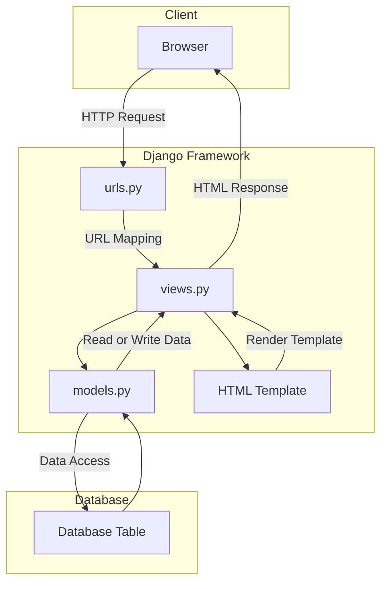

# The Hunter's Workshop

**Assignment 3:  Forms and Data Delivery Implementation in Django**

Website URL :

Name : Bramantyo Priyo Utomo

Class : PBP - International

## Implementation

1. The first thing I did on the project is to initialize git inside of the Project Folder Which I named `Inventory-management-app`.

2. The second step is to configure my GitHub username and email by using the `git config user.name` and `git config user.email` to the Project Folder.

3. The third step I did is create a `.gitignore` file and a placeholder `README.md` file.

4. Then finally on the fourth step, I installed the Django `main` app in the project folder using a Python virtual environment, because I am using a mac, the way I activated the Python virtual environment is by using the `python -m venv env` command and activate it using `source env/bin/activate` in the terminal.

5. On the fifth step, I implemented and integrated the basic model view template for the website, where I filled the `models.py`, `views.py`, and also the template `html` file.

6. The sixth step is configuring the URL routing for main, where I filled in the `urls.py` file inside the main and in the project folder.

7. The seventh step is filling in the file to create a placeholder test file.

8. The eighth step is adding, committing, and pushing all the files from my local project folder into my GitHub repository. This was where I made the mistake of pushing the wrong directory into my repo, I mistakenly navigated into the `Django project folder` instead of the `outside project` folder which I then quickly discovered that I can just move the files of the into the outside `project folder` which reverted my mistake.

9. After realizing that I have `git push`-ed the placeholder project, I quickly filled in the correct model in the `models.py` files where I put all of the attributes for the `weapons` class for The Hunter's Workshop.

10. And that concludes the Implementations. The app should be deployed shortly after I have finished typing this `README.md`, which I have linked the url at the top of this file.

11. A little update, there have been some drama surrounding the `Adaptable.io` site for deployment, which I have been banned from using. Thus the deployment of this repo has been postponed.

## Implementing forms into `views.py` and `urls.py`
12. To implement a form input to add a model object, I created a new file inside the `main` folder named `forms.py` as such: 
```python
from django.forms import ModelForm
from main.models import Weapons


class WeaponForm(ModelForm):
    class Meta:
        model = Weapons
        fields = [
            "name",
            "type",
            "attack_rating",
            "amount",
            "description",
        ]
```

13. And in the `views.py` file inside the `main` folder, I imported the `WeaponForm` class from the `forms.py`.

14. Then I added the `weapons: weapon` to the show_main function so that the form could be displayed inside the main.

15. In the `urls.py` file, I also imported the `create_weapon.html` so that the form is shown properly.

16. I also added the following block of code to `urlpatterns`.

```python
path('create-weapon', create_weapon, name='create_weapon'),
```

17. Remember the `create_weapon.html` file, it looks something like this:

```html
 


<h1>Add New Weapon</h1>

<form method="POST">
    
    <table>
        {{ form.as_table }}
        <tr>
            <td></td>
            <td>
                <input type="submit" value="Add Product"/>
            </td>
        </tr>
    </table>
</form>


```

18. I also updated the `main.html` file so that the form and the table is displayed in main.

```html
<table>
    <tr>
        <th>Name</th>
        <th>Type</th>
        <th>Attack Rating</th>
        <th>Amount</th>
        <th>Description</th>
        <th>Date Added</th>
    </tr>

    
        <tr>
            <td>{{weapon.name}}</td>
            <td>{{weapon.type}}</td>
            <td>{{weapon.attack_rating}}</td>
            <td>{{weapon.amount}}</td>
            <td>{{weapon.description}}</td>
            <td>{{weapon.date_added}}</td>
        </tr>
    
</table>

<br />

<a href="">
    <button>
        Add New Weapon
    </button>
</a>

```

19. I also added a counter to `main` by updating the `show_main` function as such:

```python
def show_main(request):
    weapons = Weapons.objects.all()
    counter = Weapons.objects.count()
    context = {
        "name": "Bramantyo",
        "class": "PBP International",
        "weapons": weapons,
        "counter": counter,
    }

    return render(request, "main.html", context)
```

20. I also added 5 new views in `views.py` file so that the objects could be viewed in `HTML`, `XML`, `JSON`, `XML by ID`, and `JSON by ID` formats. as such:

```python
def show_xml(request):
    data = Weapons.objects.all()
    return HttpResponse(
        serializers.serialize("xml", data), content_type="application/xml"
    )


def show_json(request):
    data = Weapons.objects.all()
    return HttpResponse(
        serializers.serialize("json", data), content_type="application/json"
    )


def show_xml_by_id(request, id):
    data = Weapons.objects.filter(pk=id)
    return HttpResponse(
        serializers.serialize("xml", data), content_type="application/xml"
    )


def show_json_by_id(request, id):
    data = Weapons.objects.filter(pk=id)
    return HttpResponse(
        serializers.serialize("json", data), content_type="application/json"
    )
```

21. In order for the functions to be able to run properly, I added the following to the `urls.py` `urlspattern` as such:

```python
    path("xml/", show_xml, name="show_xml"),
    path("json/", show_json, name="show_json"),
    path("xml/<int:id>/", show_xml_by_id, name="show_xml_by_id"),
    path("json/<int:id>/", show_json_by_id, name="show_json_by_id"),
```

## Django MVT Diagram



## Virtual Environment

Virtual Environment is a tool that helps to keep dependencies required by different projects separate by creating isolated python virtual environments for them. This is one of the most important tools that most of the Python developers use.

The way I used Virtual Enviroment in this project is by creating a virtual environment inside of the project folder, which I named `env`. I then activated the virtual environment by `python -m venv env` and activate it using `source env/bin/activate` inside the terminal and installed the Django app inside of it. This way, the Django app is only installed inside of the virtual environment and not on my local machine.

Virtual Environments also make it easier to collaborate with other developers. Other developers can easily install the dependencies used by the project without interfering with other projects or their dependencies.

## MVC, MVT, and MVVM

`MVC` or Model View Controller is a software design pattern that is used to develop web applications. The `MVC` pattern separates an application into three main components: the Model, the View, and the Controller.

`MVT` on the other hand is a software design pattern that is a variation of the `MVC` pattern used for developing web applications. The `MVT` pattern separates an application into three main components: the Model, the View, and the Template.

And finally, `MVVM` is a software design pattern that is a variation of the `MVC` pattern used for developing web applications. The `MVVM` pattern separates an application into three main components: the Model, the View, and the View Model.

## Difference between POST form and GET form in Django

In Django, both `POST` and `GET` are `HTTP` methods used to request and send data to a web server. When working with forms in Django, the choice between using `POST` and `GET` has significant implications for how the data is transmitted and processed.

1. `GET`:
Data is appended to the URL as query parameters.
Visible in the URL.
Less secure for sensitive information.
Suitable for read-only operations and bookmarkable URLs.
May be cached by browsers.
Idempotent (should not change server state).
2. `POST`:
Data is sent in the request body.
Not visible in the URL.
More secure for sensitive information.
Suitable for actions that modify server data.
Not typically cached by browsers.
Not idempotent (can change server state).

## Main differences between XML, JSON, and HTML in data delivery

`XML`, `JSON`, and `HTML` are three different data formats used for various purposes, including data delivery.

1. **`XML` (Extensible Markup Language):**

Purpose: Versatile markup language for structuring and describing data.
Syntax: Uses tags enclosed in angle brackets, requiring opening and closing tags.
Human-Readability: Human-readable but can be verbose.
Data Types: No native data types; must be defined within the document structure.
Usage: Commonly used for data interchange, configuration files, and document storage.
Extensibility: Highly extensible, allowing custom tags and 
structures.

2. **`JSON` (JavaScript Object Notation):**

Purpose: Lightweight data interchange format for easy data exchange.
Syntax: Simple and concise, using key-value pairs with support for nested structures.
Human-Readability: Highly human-readable and preferred for configuration files and APIs.
Data Types: Supports strings, numbers, booleans, arrays, and objects.
Usage: Widely used in web development, APIs, and web services.
Extensibility: Less extensible, follows a predefined key-value pair structure.

3. **`HTML` (Hypertext Markup Language):**

Purpose: Primarily used for structuring and rendering web content.
Syntax: Defines content structure with predefined tags for headings, paragraphs, lists, etc.
Human-Readability: Designed for human consumption, focused on content presentation.
Data Types: Primarily deals with text and multimedia content.
Usage: Exclusively for web content presentation and rendering in web browsers.
Extensibility: Not designed for extensibility, has a fixed set of tags and elements.

## Why is JSON often used in data exchange between modern web apps?

`JSON`'s simplicity, efficiency, compatibility, and versatility make it a go-to choice for data exchange in modern web applications. Its ease of use and broad support across different technologies have contributed to its widespread adoption in the web development ecosystem.

## This is what happens when we access the URLs using Postman


