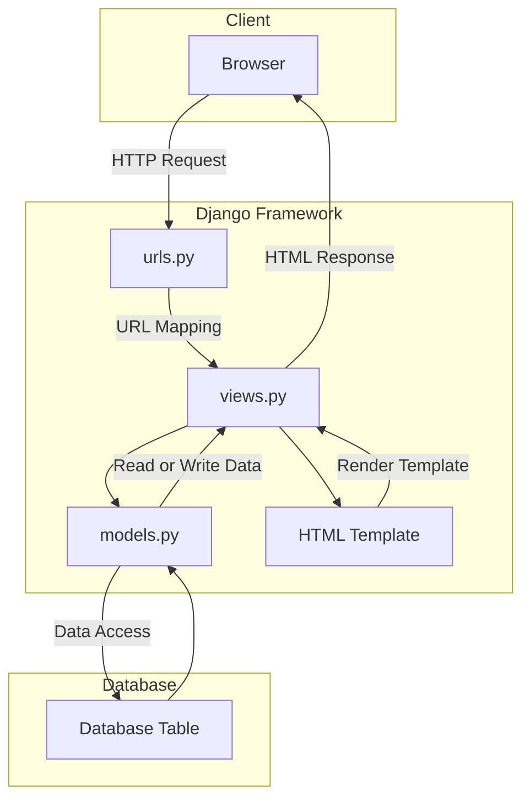

# The Hunter's Workshop

**Assignment 4: Implementing Authentication, Sessions, and `cookies` in Django**

Website URL :

Name : Bramantyo Priyo Utomo

Class : PBP - International

## Implementation

1. The first thing I did on the project is to initialize git inside of the Project Folder Which I named `Inventory-management-app`.

2. The second step is to configure my GitHub username and email by using the `git config user.name` and `git config user.email` to the Project Folder.

3. The third step I did is create a `.gitignore` file and a placeholder `README.md` file.

4. Then finally on the fourth step, I installed the Django `main` app in the project folder using a Python virtual environment, because I am using a mac, the way I activated the Python virtual environment is by using the `python -m venv env` command and activate it using `source env/bin/activate` in the terminal.

5. On the fifth step, I implemented and integrated the basic model view template for the website, where I filled the `models.py`, `views.py`, and also the template `html` file.

6. The sixth step is configuring the URL routing for main, where I filled in the `urls.py` file inside the main and in the project folder.

7. The seventh step is filling in the file to create a placeholder test file.

8. The eighth step is adding, committing, and pushing all the files from my local project folder into my GitHub repository. This was where I made the mistake of pushing the wrong directory into my repo, I mistakenly navigated into the `Django project folder` instead of the `outside project` folder which I then quickly discovered that I can just move the files of the into the outside `project folder` which reverted my mistake.

9. After realizing that I have `git push`-ed the placeholder project, I quickly filled in the correct model in the `models.py` files where I put all of the attributes for the `weapons` class for The Hunter's Workshop.

10. And that concludes the Implementations. The app should be deployed shortly after I have finished typing this `README.md`, which I have linked the url at the top of this file.

11. A little update, there have been some drama surrounding the `Adaptable.io` site for deployment, which I have been banned from using. Thus the deployment of this repo has been postponed.

## Implementing forms into `views.py` and `urls.py`
12. To implement a form input to add a model object, I created a new file inside the `main` folder named `forms.py` as such: 
```python
from django.forms import ModelForm
from main.models import Weapons


class WeaponForm(ModelForm):
    class Meta:
        model = Weapons
        fields = [
            "name",
            "type",
            "attack_rating",
            "amount",
            "description",
        ]
```

13. And in the `views.py` file inside the `main` folder, I imported the `WeaponForm` class from the `forms.py`.

14. Then I added the `weapons: weapon` to the show_main function so that the form could be displayed inside the main.

15. In the `urls.py` file, I also imported the `create_weapon.html` so that the form is shown properly.

16. I also added the following block of code to `urlpatterns`.

```python
path('create-weapon', create_weapon, name='create_weapon'),
```

17. Remember the `create_weapon.html` file, it looks something like this:

```html
 


<h1>Add New Weapon</h1>

<form method="POST">
    
    <table>
        {{ form.as_table }}
        <tr>
            <td></td>
            <td>
                <input type="submit" value="Add Product"/>
            </td>
        </tr>
    </table>
</form>


```

18. I also updated the `main.html` file so that the form and the table is displayed in main.

```html
<table>
    <tr>
        <th>Name</th>
        <th>Type</th>
        <th>Attack Rating</th>
        <th>Amount</th>
        <th>Description</th>
        <th>Date Added</th>
    </tr>

    
        <tr>
            <td>{{weapon.name}}</td>
            <td>{{weapon.type}}</td>
            <td>{{weapon.attack_rating}}</td>
            <td>{{weapon.amount}}</td>
            <td>{{weapon.description}}</td>
            <td>{{weapon.date_added}}</td>
        </tr>
    
</table>

<br />

<a href="">
    <button>
        Add New Weapon
    </button>
</a>

```

19. I also added a counter to `main` by updating the `show_main` function as such:

```python
def show_main(request):
    weapons = Weapons.objects.all()
    counter = Weapons.objects.count()
    context = {
        "name": "Bramantyo",
        "class": "PBP International",
        "weapons": weapons,
        "counter": counter,
    }

    return render(request, "main.html", context)
```

20. I also added 5 new views in `views.py` file so that the objects could be viewed in `HTML`, `XML`, `JSON`, `XML by ID`, and `JSON by ID` formats. as such:

```python
def show_xml(request):
    data = Weapons.objects.all()
    return HttpResponse(
        serializers.serialize("xml", data), content_type="application/xml"
    )


def show_json(request):
    data = Weapons.objects.all()
    return HttpResponse(
        serializers.serialize("json", data), content_type="application/json"
    )


def show_xml_by_id(request, id):
    data = Weapons.objects.filter(pk=id)
    return HttpResponse(
        serializers.serialize("xml", data), content_type="application/xml"
    )


def show_json_by_id(request, id):
    data = Weapons.objects.filter(pk=id)
    return HttpResponse(
        serializers.serialize("json", data), content_type="application/json"
    )
```

21. In order for the functions to be able to run properly, I added the following to the `urls.py` `urlspattern` as such:

```python
    path("xml/", show_xml, name="show_xml"),
    path("json/", show_json, name="show_json"),
    path("xml/<int:id>/", show_xml_by_id, name="show_xml_by_id"),
    path("json/<int:id>/", show_json_by_id, name="show_json_by_id"),
```
## Implementing Authentication, Sessions, and `cookies` in Django

22. The first thing I did was to implement the registration form and functionality in the `views.py` file as such:

```python
from django.shortcuts import redirect
from django.contrib.auth.forms import UserCreationForm
from django.contrib import messages  

def register(request):
    form = UserCreationForm()

    if request.method == "POST":
        form = UserCreationForm(request.POST)
        if form.is_valid():
            form.save()
            messages.success(request, "Your account has been successfully created!")
            return redirect("main:login")
    context = {"form": form}
    return render(request, "register.html", context)
```

23. Then I created a new HTML file named `register.html` inside the `templates` folder as such:

```html



    <title>Register</title>


  

<div class = "login">
    
    <h1>Register</h1>  

        <form method="POST" >  
              
            <table>  
                {{ form.as_table }}  
                <tr>  
                    <td></td>
                    <td><input type="submit" name="submit" value="Daftar"/></td>  
                </tr>  
            </table>  
        </form>

      
        <ul>   
              
                <li>{{ message }}</li>  
                  
        </ul>   
    

</div>  


```

24. I also added the following to the `urls.py` file so that the `register` function could be accessed properly:

```python
    path("register/", register, name="register"),
```

25. Then I added the login function inside `views.py` as such:

```python
from django.contrib.auth import authenticate, login

def login_user(request):
    if request.method == "POST":
        username = request.POST.get("username")
        password = request.POST.get("password")
        user = authenticate(request, username=username, password=password)
        if user is not None:
            login(request, user)
            response = HttpResponseRedirect(reverse("main:show_main"))
            response.set_cookie("last_login", str(datetime.datetime.now()))
            return response
        else:
            messages.info(
                request, "Sorry, incorrect username or password. Please try again."
            )
    context = {}
    return render(request, "login.html", context)
```

26. I also created a new HTML file called `login.html` inside the main app as such:

```html



    <title>Login</title>




<div class = "login">

    <h1>Login</h1>

    <form method="POST" action="">
        
        <table>
            <tr>
                <td>Username: </td>
                <td><input type="text" name="username" placeholder="Username" class="form-control"></td>
            </tr>
                    
            <tr>
                <td>Password: </td>
                <td><input type="password" name="password" placeholder="Password" class="form-control"></td>
            </tr>

            <tr>
                <td></td>
                <td><input class="btn login_btn" type="submit" value="Login"></td>
            </tr>
        </table>
    </form>

    
        <ul>
            
                <li>{{ message }}</li>
            
        </ul>
         
        
    Don't have an account yet? <a href="">Register Now</a>

</div>


```

27. Inside the `urls.py` I added a new path to `urlpatterns` as such:

```python
    path("login/", login_user, name="login"),
```

28. Then I added a logout function to `views.py` as such:

```python
from django.contrib.auth import logout

def logout_user(request):
    logout(request)
    return redirect('main:login')
```

29. Inside the `main.html`, I added a new button to the page as such:

```html
<a href="">
    <button>
        Logout
    </button>
</a>
```

30. I also added a new url to `urls.py` as such:
```python
from main.views import logout_user

path('logout/', logout_user, name='logout'),
```

31. I also restricted the access to the `main` page by adding the `@login_required` decorator to the `show_main` function as such:

```python
from django.contrib.auth.decorators import login_required

@login_required(login_url='/login')
def show_main(request):
```

32. I will also explore the use of `cookies` by adding a "last login" feature to the `login` function inside `views.py` as such:

```python
import datetime
from django.http import HttpResponseRedirect
from django.urls import reverse

if user is not None:
    login(request, user)
    response = HttpResponseRedirect(reverse("main:show_main")) 
    response.set_cookie('last_login', str(datetime.datetime.now()))
    return response
```

33. Inside the `show_main` function in `views.py` I also added a last login as such:

```python
@login_required(login_url="/login")
def show_main(request):
    weapons = Weapons.objects.filter(user=request.user)
    counter = weapons.count()
    context = {
        "name": request.user.username,
        "class": "PBP International",
        "weapons": weapons,
        "counter": counter,
        "last_login": request.COOKIES["last_login"]
        if "last_login" in request.COOKIES.keys()
        else "",
    }

    return render(request, "main.html", context)
```

34. I also modified the `logout_user` function as such:
```python
def logout_user(request):
    logout(request)
    response = HttpResponseRedirect(reverse('main:login'))
    response.delete_cookie('last_login')
    return response
```

35. Inside the `main.html` file, I addded the last login session which displays the last login time as such:

```html
<h5>Last login session: {{ last_login }}</h5>
```

36. To connect the `Weapons` model to `user` model, I need to link the object to the `user` who created it, I implemented it as such:

```python
from django.contrib.auth.models import User

class Weapons(models.Model):
    user = models.ForeignKey(User, on_delete=models.CASCADE)
```

37. Inside the `create_weapon` function in `views.py`, I also modified the code as follows:

```python
def create_weapon(request):
    form = WeaponForm(request.POST or None)

    if form.is_valid() and request.method == "POST":
        weapon = form.save(commit=False)
        weapon.user = request.user
        weapon.save()
        return HttpResponseRedirect(reverse("main:show_main"))

    context = {"form": form}
    return render(request, "create_weapon.html", context)
```

38. I also modified the `show_main` function as such, this makes sure that the objects that users created are shown in the main page and counts the correct number of weapons that the user has created:

```python
@login_required(login_url="/login")
def show_main(request):
    weapons = Weapons.objects.filter(user=request.user)
    counter = weapons.count()
```

## Django MVT Diagram



## Virtual Environment

Virtual Environment is a tool that helps to keep dependencies required by different projects separate by creating isolated python virtual environments for them. This is one of the most important tools that most of the Python developers use.

The way I used Virtual Enviroment in this project is by creating a virtual environment inside of the project folder, which I named `env`. I then activated the virtual environment by `python -m venv env` and activate it using `source env/bin/activate` inside the terminal and installed the Django app inside of it. This way, the Django app is only installed inside of the virtual environment and not on my local machine.

Virtual Environments also make it easier to collaborate with other developers. Other developers can easily install the dependencies used by the project without interfering with other projects or their dependencies.

## MVC, MVT, and MVVM

`MVC` or Model View Controller is a software design pattern that is used to develop web applications. The `MVC` pattern separates an application into three main components: the Model, the View, and the Controller.

`MVT` on the other hand is a software design pattern that is a variation of the `MVC` pattern used for developing web applications. The `MVT` pattern separates an application into three main components: the Model, the View, and the Template.

And finally, `MVVM` is a software design pattern that is a variation of the `MVC` pattern used for developing web applications. The `MVVM` pattern separates an application into three main components: the Model, the View, and the View Model.

## Difference between POST form and GET form in Django

In Django, both `POST` and `GET` are `HTTP` methods used to request and send data to a web server. When working with forms in Django, the choice between using `POST` and `GET` has significant implications for how the data is transmitted and processed.

1. `GET`:
Data is appended to the URL as query parameters.
Visible in the URL.
Less secure for sensitive information.
Suitable for read-only operations and bookmarkable URLs.
May be cached by browsers.
Idempotent (should not change server state).
2. `POST`:
Data is sent in the request body.
Not visible in the URL.
More secure for sensitive information.
Suitable for actions that modify server data.
Not typically cached by browsers.
Not idempotent (can change server state).

## Main differences between XML, JSON, and HTML in data delivery

`XML`, `JSON`, and `HTML` are three different data formats used for various purposes, including data delivery.

1. **`XML` (Extensible Markup Language):**

Purpose: Versatile markup language for structuring and describing data.
Syntax: Uses tags enclosed in angle brackets, requiring opening and closing tags.
Human-Readability: Human-readable but can be verbose.
Data Types: No native data types; must be defined within the document structure.
Usage: Commonly used for data interchange, configuration files, and document storage.
Extensibility: Highly extensible, allowing custom tags and 
structures.

2. **`JSON` (JavaScript Object Notation):**

Purpose: Lightweight data interchange format for easy data exchange.
Syntax: Simple and concise, using key-value pairs with support for nested structures.
Human-Readability: Highly human-readable and preferred for configuration files and APIs.
Data Types: Supports strings, numbers, booleans, arrays, and objects.
Usage: Widely used in web development, APIs, and web services.
Extensibility: Less extensible, follows a predefined key-value pair structure.

3. **`HTML` (Hypertext Markup Language):**

Purpose: Primarily used for structuring and rendering web content.
Syntax: Defines content structure with predefined tags for headings, paragraphs, lists, etc.
Human-Readability: Designed for human consumption, focused on content presentation.
Data Types: Primarily deals with text and multimedia content.
Usage: Exclusively for web content presentation and rendering in web browsers.
Extensibility: Not designed for extensibility, has a fixed set of tags and elements.

## Why is JSON often used in data exchange between modern web apps?

`JSON`'s simplicity, efficiency, compatibility, and versatility make it a go-to choice for data exchange in modern web applications. Its ease of use and broad support across different technologies have contributed to its widespread adoption in the web development ecosystem.

## This is what happens when we access the URLs using Postman


## `UserCreationForm` in Django

`UserCreationForm` is a built-in Django form that provides a simple way to create a new user account. It is a subclass of `django.contrib.auth.forms.UserCreationForm` and provides a set of fields for the user to enter their username, email, and password.

Advantages:

1. `UserCreationForm` is easy to use and requires minimal setup.
2. It provides built-in validation for the username, email, and password fields.
3. It automatically hashes the password before storing it in the database.
4. It can be customized to include additional fields or validation.

Disadvantages: 

1. `UserCreationForm` provides a limited set of fields and may not be suitable for all use cases.
2. It does not provide any additional features such as email verification or two-factor authentication.
3. It may not be suitable for applications that require more complex user registration workflows.

Overall, `UserCreationForm` is a useful tool for quickly creating a simple user registration form in Django. However, for more complex applications, it may be necessary to create a custom registration form that includes additional fields and features.

## Differences Betweeen Authentication and Authorization

Authentication is the process of verifying the identity of a user. In Django, authentication is the process of verifying that a user is who they claim to be. This is typically done by asking the user to provide a username and password, and then checking those credentials against a database of users. Django provides built-in authentication views and forms that make it easy to add authentication to your application.

Authorization, on the other hand, is the process of determining what a user is allowed to do. In Django, authorization is the process of determining whether a user has permission to perform a specific action, such as accessing a particular page or editing a particular object. Django provides a built-in permission system that allows you to define permissions for your models and views.

Authentication and authorization are both important for web application security. Authentication verifies the identity of a user, while authorization determines what a user is allowed to do. Django provides built-in tools for both authentication and authorization, making it easy to add these features to your application.

## `cookies` in Websites

`Cookies` are small text files that are stored on a user's computer by a website. They are used to store information about the user's preferences, login status, and other data that can be used to personalize the user's experience on the website.

In Django, cookies are used to manage user session data. When a user logs in to a Django application, a session is created for that user. The session data is stored on the server, but a unique session ID is also stored in a cookie on the user's computer. This allows the server to identify the user and retrieve their session data when they make subsequent requests to the application.

By default, Django uses a secure, cryptographically signed cookie to store the session ID. This helps to prevent tampering and ensures that the session data is only accessible to the server.

## Security of `Cookies`

`cookies` can be secure to use if they are implemented correctly. However, there are potential risks that you should be aware of when using `cookies` in your web application.

One potential risk is that `cookies` can be intercepted or tampered with by attackers. If a cookie is intercepted, an attacker could use it to impersonate the user and gain access to their account. To mitigate this risk, it is important to use secure, encrypted `cookies` that cannot be easily tampered with.

`cookies` can also be vulnerable to cross-site scripting (XSS) attacks. If an attacker is able to inject malicious code into a website, they could use it to steal `cookies` or other sensitive information from users. To mitigate this risk, it is important to use secure coding practices and to sanitize all user input to prevent XSS attacks.